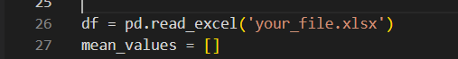

# Unity Based Data Generator

# 1.Description

This is a tool for data analysis. It will display Mean Median and mode. Further function developing

# 2. Set up

### (1) Install [python](https://www.python.org/)

### (2) Install requirements

```
    pip install requirement.txt
```

# 3. How to use

### (1) Modify file path on line 26 in `data_analysis.py`

<p align="center">
  
</p>

### (2) Start program

```
    python data_analysis.py
```

# 4. reference

https://github.com/rdbende/Forest-ttk-theme

# 5. example
<p align="center">
  
</p>
