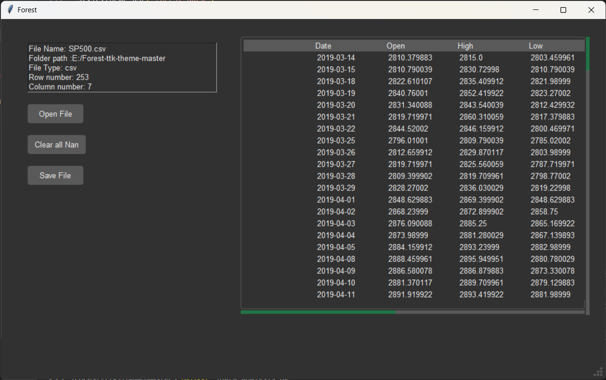

# Python Data Analysis

# 1.Description

This is a tool for data analysis. It will display Mean Median and mode. Further function developing

# 2. Set up

(1) Install [python](https://www.python.org/)

(2) Install requirements

```
pip install requirement.txt
```

# 3. How to use

(1) Select file that you want to proces

(2) Start program

```
python data_analysis.py
```

(3) Use functions

(4) Click save file button, result will be saved as file_name_processed.extension

# 4. reference

[Foreset-ttk-theme](https://github.com/rdbende/Forest-ttk-theme)

# 5. example

<p align="center">
  
</p>

# 6. Update

## 4/23/2024

* Add info frame
* Finished open new file

## 4/22/2024

* Fix save csv file error
* Open new file half implemented

## 4/21/2024

* Now accepting both excel and csv file reading and saving
* Fix column shrinking when being resized
* Fix saving excel file with wrong extension

## 4/20/2024

* Add file selection at start
* Add file save button
